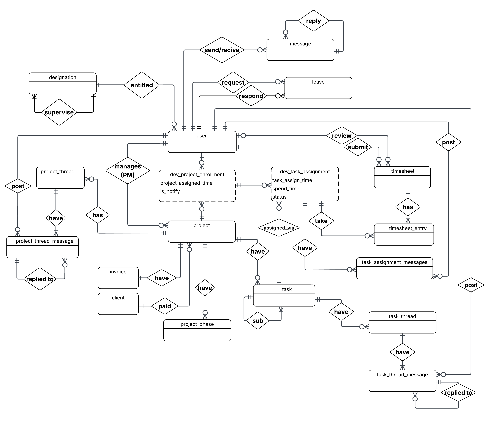
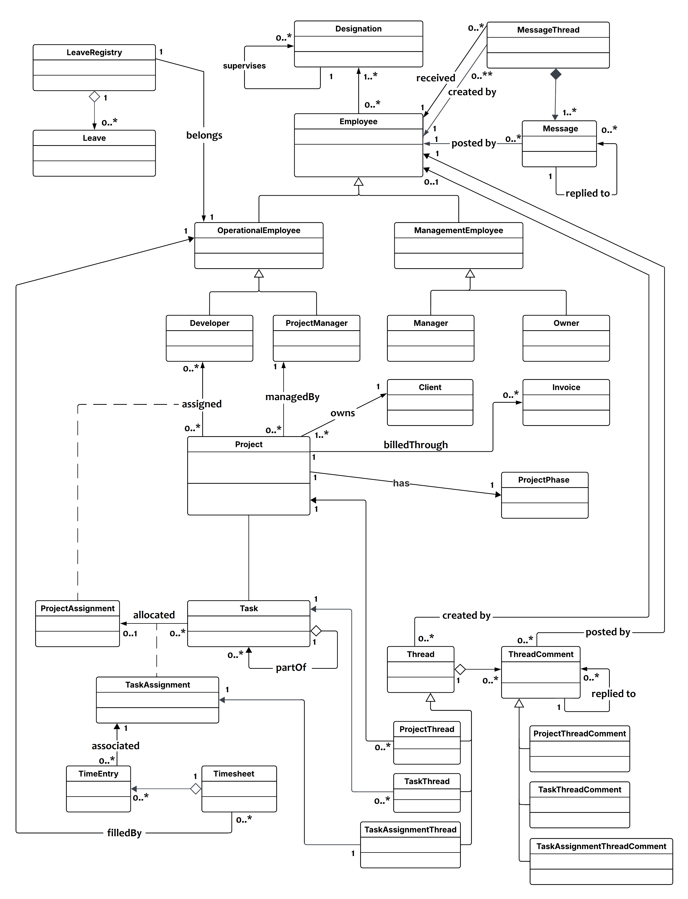

## Table of Contents

- [Introduction](#introduction)
- [Project Overview](#project-overview)
- [Objective](#objective)
- [Requirements](#requirements)
- [ER diagram](#er-diagram)
- [Overall class diagram](#overall-class-diagram)  
- [Modules](#modules)
	- [Project management module](#project-management-module)
	- [Task management module](#task-management-module)
	- [Project progress tracking module](#project-progress-tracking-module)
	- [Timesheet management module](#timesheet-management-module)
	- [User management module](#user-management-module)
	- [Designation management module](#designation-management-module)
	- [Communication module](#communication-module)
	- [Reporting module](#reporting-module)
	- [Leave management module](#leave-management-module)
	- [Resource allocation module](#resource-allocation-module)
- [Creating & Integrating a Laravel Module](#creating--integrating-a-laravel-module)
    - [Part 1 — Creating a Module](#part-1--creating-a-module)
    - [Part 2 — Integrating the Module into the Project](#part-2--integrating-the-module-into-the-project)
    - [summary](#summary)
- [How to Run Migrations #how-to-run-migrations](#how-to-run-migrations)
- [How to Seed Data #how-to-seed-data](#how-to-seed-data)


## Introduction
This web application is custom project management software system for FutureSoft Pvt 
Ltd.system will be structured into logically organized modules using Object-Oriented Analysis and Design (OOAD) 
principles

***

## Project Overview
This Project Management System is a customized software solution designed to help FutureSoft Pvt Ltd efficiently manage 
its internal projects, teams, and workflows

### Key features of the system
- Project creation and management
- Task assignment and tracking
- Role-based access control
- Progress monitoring and reporting

### Target Users
The system will support four user roles within the company:
- Company Owner (Owner)
- Manager
- Project Manager (PM)
- Developer (Dev)

***

## Objective
Objective of this guide is Design the system using Object-Oriented Analysis and Design (OOAD) principles, and organize it into modules.
for that we consider two possible approaches:

1. Single Class Diagram Approach – Create one comprehensive class diagram for the entire system and divide it into modules.
2. Package-Wise Class Diagrams Approach – Create separate class diagrams for each module

In this guide, we use Single Class Diagram Approach approach

***

## Requirements
> Markdown is a lightweight markup language with plain-text-formatting syntax, created in 2004 by John Gruber with Aaron Swartz.
>
>> Markdown is often used to format readme files, for writing messages in online discussion forums, and to create rich text using a plain text editor.  

**[View requirements page](./docs/req.md)**

***

## ER diagram
ER diagram consist most im,portnat attributes only  

  
All attributes are not shown in the ER diagram to avoid clutter and maintain clarity. Only key 
attribute were include for better readability.


**[Goto ER diagram page to view all attributes of the entities](./docs/er.md)**

***

## Overall class diagram  

  
When draw class diagram 

- Attributes and behaviors of the classes are omitted to keep the class diagram simple and readable.  
- Minimized bidirectional associations to optimize performance and memory usage
- Some associations were skipped to maintain clarity in the diagram, as they were not considered essential. Those are 
    - Timesheet ----approvedBy--> managementEmployee
    - Leave ----approvedBy--> managementEmployee

**[Goto class diagram page to view all attributes and behaviours of the classes](./docs/cls.md)**

***

## Packages
To develop the project management system for FutureSoft Pvt Ltd, we first gathered key stakeholders to understand their needs. 
Based on the requirements, we defined core system tasks and organized the functionality into structured modules for clarity and 
maintainability. 

### Project management module 
| Authorized | Description |
| --- | --- |
| Owner | Create project profile with Client information and Project Plan |
| Owner | Add project Details to project profile |
| Owner | Add Scheduled Dates to project profile such as Delivery Date, deadline |
| Owner | Categorize Projects as local or foreign |
| Owner | Managing project profile |
| Owner, Manager, PM, Assigned Dev | View project profile |
| | project statuses: Initiated, In Progress, On Hold, Completed, Cancelled. |
| |
| | **Project timeline** |
| | set,Display Scheduled Milestones for the project |
| | set,Display Actual Duration of Milestones for the project |
| | mark complete for Actual Milestones of the project |
| |
| | **Project costing** |
| Manager, Owner, Assigned PM | Add costing factors and cost |
| Manager, Owner, Assigned PM | Calculate Employee cost (Employee cost  = employee hourly rate * time) |
| Manager, Owner, Assigned PM | Calculate total Cost |
| Manager, Owner, Assigned PM | Add incomes to the project cost profile |
| Manager, Owner, Assigned PM | deduct income amount from cost.(Calculating profit) |
| Manager, Owner, Assigned PM | list income, costs , filter by (incomes, costs) |

***

### Task management module
| Authorized | Description |
| --- | --- |
| Assigned PM | Divide project into sub tasks that consist of maximum two levels. |
| PM | set Estimate time, Delivery date to the Tasks |
| Dev | Submit task with Spend time and additional comment.(done/cannot done) |
| | view task info(including delivery status) |
| | Add priority levels (High, Medium, Low) and allow sorting/filtering |
| | ~~Attach documents, screenshots, or specifications to each task~~  |

***

### Project progress tracking module
| Authorized | Description |
| --- | --- |
| | The project is split into different phases, and the progress is measured by the percentage of each phase that has been completed |
| | show percentages for each phase of the project |
| | Project phase completion % = (Number of Done tasks/Total number of tasks) * 100% |
| | Project-wise, view the progress of tasks according to their progress levels (progress levels - pending, submited, delayed-pending, delayed-submited) |
| PM, Owner, Manager, Assigned Dev | View Project progress by it's phases |
| PM, Owner, Manager | ~~calculat and show Project Estimate time.(WHEN ALL TASK EST TIME SET)~~ |
| |
| | ~~show  recent tasks that complete~~ |
| | show  recent tasks that have to complete(near deadline) -> in Dashboard |
| | show  recent tasks that exceed the deadline -> in Dashboard |

~~task => Attach documents, screenshots, or file to each task~~  

***

### Timesheet management module
| Authorized | Description |
| --- | --- |
| PM, Dev | submit time sheets by monthly basis |
| Manager, Owner | approve all users timesheets |
| Manager, Owner | view all users previous timesheets(filter by month) |
| | can Mark leave days in timesheet |

***

### User management module	 
| Authorized | Description |
| --- | --- |
| | managing user account |
| Owner | manage manager, Developers and PM’s Personal Information and Demographic Information |
| Manager | manage Developers and PM’s Personal Information and Demographic Information |
| | Anyone can manage his/her own account Personal Information and Demographic Information |
| |
| | Manage Emp. Salary information, Employee hourly rate(monthly salary/22 days*8 hours), EPF-ETF details Education Qualifications and skills |
| Owner | manage above details of Manager, Developers and  PM’s |
| Manager | manage above details of Developers and PM |
| |
| | Admin level users can manage other user accounts (CRUD,working/resign, account enable/disable) |
| Owner | create, delete and change working status of manager, Developers and PM’s |
| Manager | create, delete and change working status of Developers and PM’s |
| |
| Dev, PM | Manage their Profile Picture,  Personal Information(except username)|

~~system shall give Users authenticate~~  
~~system shall be able given appropriate privileges according to their user role~~  

***

### Designation management module 
| Authorized | Description |
| --- | --- |
| Owner | Manage designation hierarchy |
| Owner | Manage designation ,sub designation information |
| |
| | admin level users can manage designations of users |
| Owner | Manage designation of manager, PM’s and Developers |
| Manager | Manage designation of PM’s and Developers |

***

### Communication module
| Authorized | Description |
| --- | --- |
| | Users shall be able pass private messages to other users(Able to upload files with private messages) |
| Project assigned dev, PM, Manager, Owner | thread to each project. can post, reply and see messages in that thread |
| Task assigned dev, Project assigned PM, Manager, Owner| thread to each Task. can post, reply and see messages in that thread |

~~message                => Attach documents, screenshots, or file to each~~  
~~project thread message => Attach documents, screenshots, or file to each~~  
~~task thread message    => Attach documents, screenshots, or file to each~~  

***

### Reporting module
| Authorized | Description |
| --- | --- |
| PM, Manager, Owner | view developer project assignment time periods with project time frame |
| PM, Manager, Owner | view employee(developer/pm) Project wise timing (spend time, schedule time) |
| PM, Manager, Owner | view Designation wise spend time for a project (spend time, schedule time) |
| |
| | Developer monthly efficincy report - tasks delayed, tasks on time, tasks before time |
| | Yearly calendar - show Planned and actual duration of the projects plotted throughout the year |
| |
| | **Dashboard page** |
| | show  recent projects that engaged in with deadlines|
| | show  recent projects that completed|
| | show  recent projects that delayed with deadlines |
| | show  recent tasks that complete |
| | ~~show  recent tasks that have to complete~~ |
| | ~~show  recent tasks that exceed the deadline~~ |
| |
| | **Deadline Calendar View** |
| | view of project deadlines in Today, week, Month |
| | view of tasks deadlines in Today, week, Month |

***

### Leave management module
| Authorized | Description |
| --- | --- |
| | PM,Dev can apply leave |
| | PM,Dev can discard applied leave |
| | Manager can approve/disapprove leave |
| | Show  recent leaves |
| | Show  leaves monthly, given date range |
| | Leave types [medical(15), Casual(10), Annual(10) per year] and track limits per type |
| | Leaves can filter in data ranges for specific DEV/PM |
| | Leaves filter by month |
| | Leave Calendar -  Display team availability in calendar view |

***

### Resource allocation module 
| Authorized | Description |
| --- | --- |
| Owner, Manager| Assign PM for a project |
| | When PROJ is assigned to a PM system shall be able to notify it to the assigned PM |
| | Before assigning PM to project → check if the PM is already assigned to other projects in the same time frame |
| |
| Project assigned PM | Assign Devs for a project |
| | When PROJ is assigned to a DEV system shall be able to notify it to the assigned user |
| | Before assigning a DEV to a project → check if the DEV is already assigned to another project in the same time frame |
| |
| Project assigned PM | Assign Tasks for Dev(project tasks for project assigned Dev) |
| | Before assigning a task → check if the DEV has a leave request overlapping with delivery date |
| | Before assigning a task → check if the Dev is already assigned to other tasks in the same time frame |
| |
| PM, Manager | ~~Resource Availability Chart Who is available, busy(task count), or on leave~~ |
| PM, Manager | Developer Workload Report =>  show selected Dev currently assigned tasks  and their deadlines, estimated times, their statues, already spend time spent |

***

## Creating & Integrating a Laravel Module

### Overview

Each module is a self-contained package that lives inside the `modules/` folder at the project root. It has its own `composer.json`, source code, database files, and tests — and integrates into the Laravel project automatically via Composer's package auto-discovery.

---

### Part 1 — Creating a Module

#### 1. Create the Folder Structure

Create your module folder inside `modules/` at the project root:

```
modules/
└── Project/
    ├── composer.json
    ├── src/
    │   ├── Providers/
    │   │   └── ProjectServiceProvider.php
    │   ├── Models/
    │   ├── Controllers/
    │   ├── Services/
    │   └── Requests/
    │── routes/
    │       ├── web.php
    │       └── api.php
    ├── database/
    │   ├── migrations/
    │   ├── seeders/
    │   └── factories/
    ├── config/
    ├── resources/
    │   └── views/
    └── tests/
        ├── TestCase.php
        ├── Unit/
        └── Feature/
```

---

#### 2. Add `composer.json` to the Module

Each module must have its own `composer.json`. All paths here are **relative to this file**, not the project root.

```json
// modules/Project/composer.json
{
    "name": "futuresoft/project-module",
    "description": "This Laravel module manages project profiles, planning documents, client records, and invoice tracking for futuresoft PVT LTD",
    "type": "library",
    "autoload": {
        "psr-4": {
            "Modules\\Project\\": "src/",
            "Modules\\Project\\Database\\Seeders\\": "database/seeders/",
            "Modules\\Project\\Database\\Factories\\": "database/factories/"
        }
    },
    "autoload-dev": {
        "psr-4": {
            "Modules\\Project\\Tests\\": "tests/"
        }
    },
    "extra": {
        "laravel": {
            "providers": [
                "Modules\\Project\\Providers\\ProjectServiceProvider"
            ]
        }
    }
}
```

> **Note:** `type` should be `"library"` not `"laravel-module"` — Composer does not recognise `laravel-module` as a valid type and may cause issues.

---

#### 3. Create the Service Provider

The Service Provider is the **entry point** of your module. It tells Laravel how to load the module's routes, migrations, views, and config.

```php
// modules/Project/src/Providers/ProjectServiceProvider.php

namespace Modules\Project\Providers;

use Illuminate\Support\ServiceProvider;

class ProjectServiceProvider extends ServiceProvider
{
    public function register(): void
    {
        $this->mergeConfigFrom(
            __DIR__ . '/../../config/config.php', 'project'
        );
    }

    public function boot(): void
    {
        $this->loadRoutesFrom(__DIR__ . '/../routes/api.php');
        $this->loadRoutesFrom(__DIR__ . '/../routes/web.php');
        $this->loadMigrationsFrom(__DIR__ . '/../../database/migrations');
        $this->loadViewsFrom(__DIR__ . '/../../resources/views', 'project');


        // to publish files inside into PROJECT_ROOT/public folder 
        // run - php artisan vendor:publish --tag=project-assets --force
        $this->publishes([
            __DIR__.'/../../resources/js'       => public_path('modules/project/js'),
            __DIR__.'/../../resources/css'      => public_path('modules/project/css'),            
            __DIR__.'/../../resources/images'   => public_path('modules/project/images'),            
        ], 'project-assets');

    }
}
```

---

#### 4. Create the Test Base Class

```php
// modules/Project/tests/TestCase.php

namespace Modules\Project\Tests;

use Orchestra\Testbench\TestCase as OrchestraTestCase;
use Modules\Project\Providers\ProjectServiceProvider;

abstract class TestCase extends OrchestraTestCase
{
    protected function getPackageProviders($app): array
    {
        return [ProjectServiceProvider::class];
    }

    protected function defineDatabaseMigrations(): void
    {
        $this->loadMigrationsFrom(__DIR__ . '/../database/migrations');
    }
}
```

---

### Part 2 — Integrating the Module into the Project

#### 1. Update Root `composer.json`

Two things need to be added — a `repositories` entry so Composer knows where to find local modules, and a `require` entry for the module itself.

```json
// composer.json (project root)
{
    "repositories": [
        {
            "type": "path",
            "url": "./modules/project"
        }
    ],
    "require": {
        "futuresoft/project-module": "*"
    }
}
```

> The `./modules/*` wildcard automatically discovers all subfolders inside `modules/`. When you add a new module in future, you only need to add it to `require` — no need to touch `repositories` again.

---

#### 2. Terminal Commands

Run these commands in order from the **project root**:

```bash
# 1. Install the module via Composer
composer update futuresoft/project-module

# 2. Regenerate the autoload files
composer dump-autoload

# 3. Run the module's migrations
php artisan migrate
```

---

#### 3. Verify Auto-Discovery

After `composer update`, confirm Laravel has detected the module's service provider:

```bash
cat bootstrap/cache/packages.php
```

You should see:

```php
'futuresoft/project-module' => [
    'providers' => [
        'Modules\\Project\\Providers\\ProjectServiceProvider',
    ],
],
```

If it appears here, the module is fully integrated — no changes needed in `config/app.php`.

---

#### 4. Add Module to `phpunit.xml` for Testing

```xml
<testsuites>
    <testsuite name="Unit">
        <directory>tests/Unit</directory>
    </testsuite>
    <testsuite name="Feature">
        <directory>tests/Feature</directory>
    </testsuite>

    <!-- Project Module -->
    <testsuite name="Project">
        <directory>modules/Project/tests</directory>
    </testsuite>
</testsuites>
```

Then run the module's tests:

```bash
# Run only this module's tests
php artisan test --testsuite=Project

# Run all tests including all modules
php artisan test
```

---

### Summary

#### Creating a Module
| Step | Action |
|---|---|
| 1 | Create folder structure under `modules/Project/` |
| 2 | Add `composer.json` with correct relative paths |
| 3 | Create `ProjectServiceProvider` and register routes, migrations, views |
| 4 | Create test base `TestCase.php` |

#### Integrating into the Project
| Step | Action |
|---|---|
| 1 | Add `repositories` with `./modules/*` to root `composer.json` |
| 2 | Add module name to `require` in root `composer.json` |
| 3 | Run `composer update futuresoft/project-module` |
| 4 | Run `composer dump-autoload` |
| 5 | Run `php artisan migrate` |
| 6 | Verify `bootstrap/cache/packages.php` shows the provider |
| 7 | Add testsuite to `phpunit.xml` and run tests |

***

## How to Run Migrations

In this project, migration files exist for both the core application and individual modules.

Some migrations must be executed in a specific order defined by the developer, rather than the default execution order. For example:

* Migrations that add foreign key constraints should be executed **after all related tables are created**.
* Migrations from certain modules may need to run **before** others due to dependencies.

Because of these requirements, you should not rely on the default migration command.

Instead, use the following command to run migrations in the correct order:

```
php artisan migrate:in-order
```

This ensures that all migrations are executed in the proper sequence, avoiding dependency and constraint issues.

***

## How to Seed Data

To seed the database correctly, especially when there are dependencies between tables and modules, follow these steps:

1. Navigate to the following file:
   `<project_root>\database\seeders\DatabaseSeeder.php`

2. Register your seeder classes inside this file in the **exact order they should be executed**.

3. In addition to core seeders, you can also include seeder classes from different modules.
   When doing this, make sure to organize them carefully so that:

   * Seeders that create foundational data (e.g., roles, users, base configurations) run first.
   * Seeders that depend on other data (e.g., relationships, mappings) run afterward.

By explicitly controlling the order in `DatabaseSeeder.php`, you ensure that all required data is inserted without conflicts or missing dependencies.

---


### TODO 
------er detailed page  
-----class diagram detaild - attr, methods 


